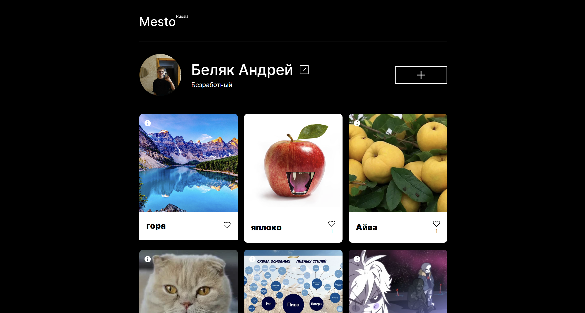
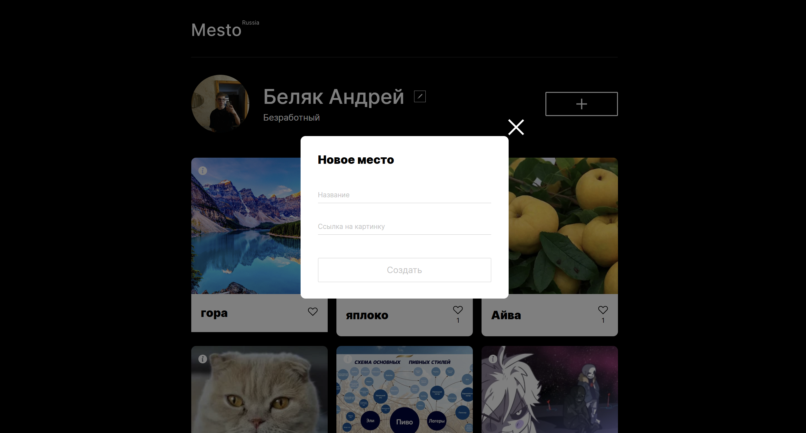
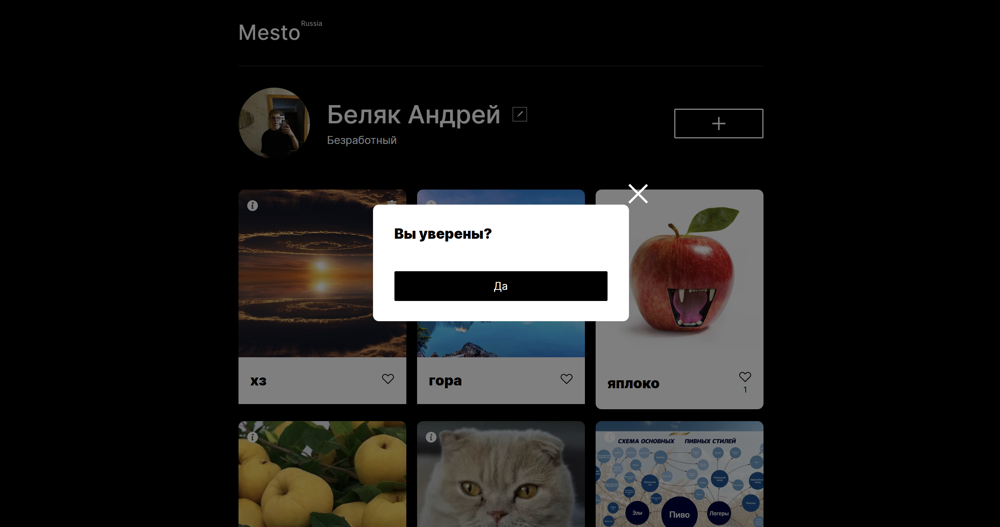

# Mesto Russia — Production Build

**⚠️ ВНИМАНИЕ: Это репозиторий содержит ТОЛЬКО production-сборку проекта.**  
Исходный код для разработки находится в другом приватном репозитории.

## 📝 Описание

Проект Mesto - интерактивная страница для обмена фотографиями. Пользователи могут редактировать свой профиль, добавлять и удалять фотографии, ставить лайки. Проект подключен к API-серверу для хранения данных пользователей и карточек.

## 🌐 Демо

## Ссылки
- [Макет в Figma](https://www.figma.com/design/5zPm3HrSi0VzEMmZneL6Sq/Mesto?node-id=1-2&p=f) — ссылка на дизайн-макет
- [Демо проекта](https://sergiomartinov31.github.io/mesto-production/) — ссылка на GitHub Pages

## ✨ Функциональность
- 📱 Адаптивная вёрстка
- ✏️ Редактирование профиля (имя, профессия, аватар)
- ➕ Добавление новых фотографий
- ❌ Удаление своих фотографий
- ❤️ Постановка и снятие лайков
- 🔍 Просмотр фотографий в полноэкранном режиме
- ✅ Валидация форм
- 🔄 Работа с сервером через REST API
- ⏳ Улучшенный UX форм (индикация загрузки)
- 🗑️ Модальное окно подтверждения удаления карточки
- 🔢 Отображение количества лайков

## 🛠 Технологии
- **HTML5** (семантическая разметка)
- **CSS3** (Flexbox, Grid, адаптивная вёрстка, БЭМ)
- **JavaScript** (ES6+, ООП, асинхронные запросы)
- **Vite** (сборка проекта)
- **REST API** (взаимодействие с сервером)
- **Git** (контроль версий)
- **GitHub Actions** (автоматический деплой)

