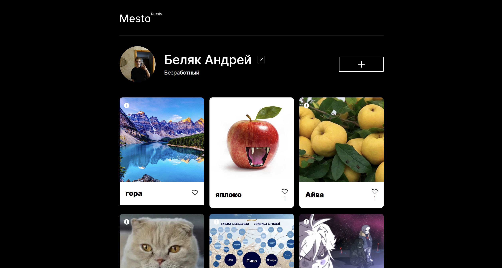
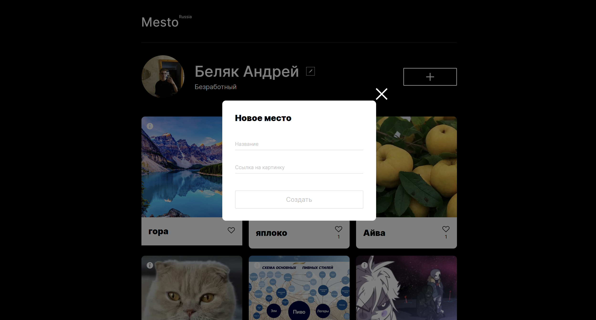
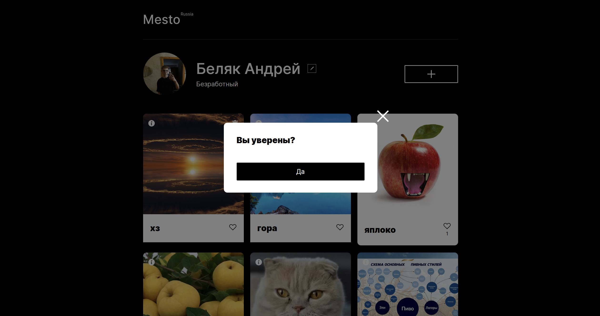

# Mesto Russia — Production Build

**⚠️ ВАЖНО: В этом репозитории размещена только production-версия приложения.**  
Код для разработки хранится в отдельном приватном репозитории.

## 📝 Описание

Mesto — веб-приложение для публикации и просмотра фотографий. Пользователь может изменять данные профиля, создавать и удалять карточки, а также ставить отметки «нравится». Все ключевые действия выполняются через API, где сохраняются сведения о пользователях и карточках.

## 🌐 Демо

## Ссылки
- [Макет в Figma](https://www.figma.com/design/5zPm3HrSi0VzEMmZneL6Sq/Mesto?node-id=1-2&p=f) — дизайн проекта
- [Демо проекта](https://andrei-229.github.io/mesto-production/) — опубликованная версия на GitHub Pages

## ✨ Функциональность
- 📱 Корректное отображение на разных размерах экрана
- ✏️ Обновление профиля (имя, род занятий, аватар)
- ➕ Создание новых карточек с фотографиями
- ❌ Удаление карточек, созданных пользователем
- ❤️ Добавление и снятие лайков
- 🔍 Открытие изображений в полноэкранном просмотре
- ✅ Проверка полей форм перед отправкой
- 🔄 Интеграция с сервером по REST API
- ⏳ Понятная индикация загрузки в формах
- 🗑️ Подтверждение перед удалением карточки
- 🔢 Вывод актуального количества лайков

## 🛠 Технологии
- **HTML5** (семантическая структура страниц)
- **CSS3** (Flexbox, Grid, адаптив, методология БЭМ)
- **JavaScript** (ES6+, ООП-подход, асинхронная работа с сетью)
- **Vite** (сборка и оптимизация проекта)
- **REST API** (обмен данными с серверной частью)
- **Git** (ведение истории изменений)
- **GitHub Actions** (автоматизированный деплой)

